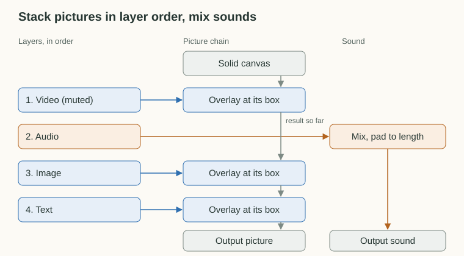

# ffmpeg compiler

The renderer in [src/lib/render](../src/lib/render) turns a project file ([project-format.md](project-format.md)) into one ffmpeg command and runs it. The render CLI runs on Node 24 directly.

```sh
pnpm setup-sample samples/synthetic
pnpm render .local/projects/synthetic/project.json .local/projects/synthetic/out/preview.mp4
pnpm render <project.json> <output> --dry-run   # print the command only
```

## Gather Facts, Compile, Run

A render has three steps. First, it gathers what the project file cannot say about its media. Each video and image source is probed once for its size, frame timing, and whether it has audio, and each text layer is drawn to a transparent PNG with ImageMagick. Then the project and those facts are compiled into ffmpeg arguments. Finally, ffmpeg runs.


Compiling reads no files and starts no processes, so it is plain data in and arguments out. All the I/O sits at the two ends. `--dry-run` stops before running ffmpeg, but it still probes the sources and writes the text PNGs, because the printed command refers to them.

## Cut Each Layer to the Output

Every layer is compiled on its own, into at most one picture stream and one sound stream. A layer does not need to know which other layers exist.

First, a layer is cut to the part that falls inside the output range. A video or audio layer spans from its `start` for the length of its source range. An image, text, or color layer spans from `start` to `end`, and a missing edge runs to the edge of the output. A layer with no visible part contributes nothing.


Each stream is trimmed to that visible part when ffmpeg reads the input, then shifted by its offset from the output start. For a video layer, trimming means seeking the source to the matching source time. Because project times are rounded to milliseconds, the seek targets the source frame nearest to that time rather than the first frame after it.

In ffmpeg terms, the cut is input options and the rest is a filter chain. The synthetic sample's video layer covers the whole three-second output and fills the 640×360 canvas:

```sh
-ss 0.000000 -t 3.000000 -i media/video.mp4   # seek to the source time, read the visible duration
```

```text
[0:v]fps=30,setpts=PTS-STARTPTS+0/TB,scale=640:360[v0]
     │      │                        └ fit to its box
     │      └ restart timestamps at 0, then shift by the offset from the output start (0 s here)
     └ resample to the canvas frame rate
```

What each layer type turns into:

| Layer | Picture                                                                    | Sound                       |
| ----- | -------------------------------------------------------------------------- | --------------------------- |
| Video | Source frames at the canvas rate, cropped, then scaled to fit its box      | Its own audio, unless muted |
| Image | The image repeated at the canvas rate, cropped, then scaled to fit its box | None                        |
| Text  | The text PNG repeated at the canvas rate, placed at its box                | None                        |
| Color | A generated solid fill with opacity, over its box or the whole canvas      | None                        |
| Audio | None                                                                       | Its audio, unless muted     |

Sound is normalized to 48 kHz stereo, faded in and out when the layer asks for it, and delayed to its offset.

The ffmpeg building blocks behind the table:

| Idea                                   | ffmpeg                                                                                                          |
| -------------------------------------- | --------------------------------------------------------------------------------------------------------------- |
| Read only the visible part of a source | input options `-ss <source time> -t <duration>`                                                                 |
| Repeat an image or text PNG            | input options `-loop 1 -framerate <fps> -t <duration>`                                                          |
| Match the canvas frame rate            | `fps=<fps>`                                                                                                     |
| Crop, then fit to the box              | `crop=iw*<w>:ih*<h>:iw*<left>:ih*<top>`, `scale=<width>:<height>`                                               |
| Generate a solid fill                  | `color=c=<color>@<opacity>:s=<width>x<height>:r=<fps>:d=<duration>`, `format=rgba`                              |
| Place on the output timeline           | `setpts=PTS-STARTPTS+<offset>/TB`                                                                               |
| Normalize, fade, and place sound       | `aformat=sample_rates=48000:channel_layouts=stereo`, `afade=t=in` and `afade=t=out`, `adelay=delays=<ms>:all=1` |

## Stack Pictures, Mix Sounds

Once every layer has its streams, one pass joins them into a single filter graph. The picture chain starts from a solid canvas covering the whole output. Each picture is overlaid on the result so far at its position, in layer order, so later layers sit on top. When a picture stream ends before the output does, the layers below show through. Every sound goes into one mix, which is padded or trimmed to the output length.



This pass is the only place that knows how streams are numbered and connected. The per-layer step only says what a layer contributes, which keeps each layer type readable on its own. To see the actual graph for a project, run the render with `--dry-run`.

For the synthetic sample, the inputs are numbered in the order they are added, and each stream is labeled by its layer. The graph below is wrapped and annotated for reading, with paths shortened:

```sh
-ss 0.000000 -t 3.000000 -i media/video.mp4          # input 0, layer 0 video
-ss 0.000000 -t 3.000000 -i media/audio.wav          # input 1, layer 1 audio
-loop 1 -framerate 30 -t 3.000 -i media/image.png    # input 2, layer 2 image
-loop 1 -framerate 30 -t 3.000 -i .text/out.mp4/3.png  # input 3, layer 3 text
```

```text
color=c=#000000:s=640x360:r=30:d=3[canvas];                             canvas
[0:v]fps=30,setpts=PTS-STARTPTS+0/TB,scale=640:360[v0];                 layer 0 picture
[canvas][v0]overlay=x=0:y=0:eof_action=pass[over0];                     stack on the canvas
[1:a]aformat=sample_rates=48000:channel_layouts=stereo,
     afade=t=in:st=0:d=0.2,afade=t=out:st=2.5:d=0.5,
     adelay=delays=0:all=1[a1];                                          layer 1 sound
[2:v]scale=160:90,setpts=PTS-STARTPTS+0/TB[v2];                         layer 2 picture
[over0][v2]overlay=x=420:y=240:eof_action=pass[over2];                  stack on the result so far
[3:v]setpts=PTS-STARTPTS+0/TB[v3];                                      layer 3 picture
[over2][v3]overlay=x=420:y=259:eof_action=pass[over3];                  stack on top
[over3]format=yuv420p[vout];                                            output picture
[a1]amix=inputs=1:normalize=0:duration=longest,apad,atrim=0:3[aout]     output sound
```

The video layer is muted, so it adds no sound. `eof_action=pass` is what lets lower layers show through after a stream ends. The text sits at `y=259` rather than its box's `260` because the 2 px outline pads the PNG by 1 px. Then the video output encodes both streams:

```sh
-map [vout] -c:v libx264 -preset medium -crf 20 -r 30 -t 3 -map [aout] -c:a aac -b:a 192k -movflags +faststart out.mp4
```

## Stills

A project whose `output` is a still renders the same graph over a single frame. The output range becomes one frame long starting at the still's time, no layer contributes sound, and ffmpeg writes one image file instead of encoding a video. A thumbnail therefore only decodes each source around its time, however long the source is.

For the synthetic thumbnail at 1.5 seconds, the video input reads one frame's worth, starting a tenth of a frame before frame 45 so ffmpeg's seek lands on it, and the output writes a single PNG:

```sh
-ss 1.496667 -t 0.033333 -i media/video.mp4
-map [vout] -frames:v 1 -update 1 thumbnail.png
```

## Results on the rescene cover (2026-09-26)

These were measured on the prototype, before it moved into `src/lib`. All four deliverables of the [RESCENE reference sample](../samples/README.md#local-rescene-reference) render and match the Kdenlive outputs.

| Deliverable             | Render time | Output            | Kdenlive output  |
| ----------------------- | ----------- | ----------------- | ---------------- |
| Horizontal thumbnail    | 0.6s        | 1920x1080 PNG     | 1920x1080 JPEG   |
| Vertical thumbnail      | 0.5s        | 1080x1920 PNG     | 608x1080 JPEG    |
| Horizontal video (165s) | 54s         | 134MB, 6.3Mbps    | 107MB, 5.3Mbps   |
| Vertical video (42s)    | 13s         | 28MB at 1080x1920 | 14MB at 608x1080 |

- Layout: side-by-side comparisons of both thumbnails match Kdenlive's, including the score crop, the MV thumbnail, the dim overlay, and the centered title, after mapping the vertical layout to a native 1080x1920 canvas.
- Stills: rendering the horizontal thumbnail at nearby frames and comparing the camera region with Kdenlive's JPEG peaks at the transcribed time (SSIM 0.991).
- Durations: both videos match Kdenlive's to the frame (164.933s and 42.367s).
- Audio: cross-correlation against Kdenlive's renders gives a lag of 0.38ms with correlation 0.99 for both videos (`uv run tools/audio-lag.py`).
- Video timing: the first version was one frame (33ms) ahead of Kdenlive's camera. The camera's in-point, 15.733s, lands 0.3ms after a source frame (the stream starts at 0.066s), and ffmpeg's accurate seek starts from the first frame at or after the seek time, so it took the next frame. The compiler now seeks to the frame whose timestamp is nearest to the source time, which matches both Kdenlive and Remotion ([research/remotion](../research/remotion/README.md)).

## Known gaps

- Color metadata is incomplete. The output is BT.709 limited range like the camera source, but only the matrix is tagged, while Kdenlive's render also tags BT.709 transfer and primaries. RGB layers (images, text, color) are likely converted to YUV with ffmpeg's default BT.601 matrix while the file says BT.709, so they may be very slightly off. The fix is to convert with `out_color_matrix=bt709:out_range=tv` and tag the output with `-colorspace bt709 -color_primaries bt709 -color_trc bt709`. It is only visible side by side.

- Encoding uses `libx264 -crf 20 -preset medium`, which comes out about 20% larger than Kdenlive's preset. Tuning is left for later.
- Text is aligned inside its box width through ImageMagick `label:` and gravity, with the outline drawn as a stroked copy underneath. Kdenlive's text item may have a small top margin that is not modeled.
- The filter graph is one command per render, so a still still spawns ffmpeg with every input. That is fast enough at 0.5s for an editor preview, but it has not been tried with longer seeks into large files.
