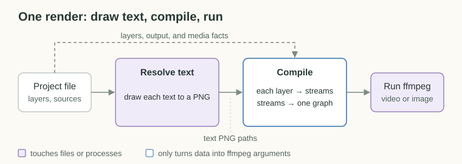
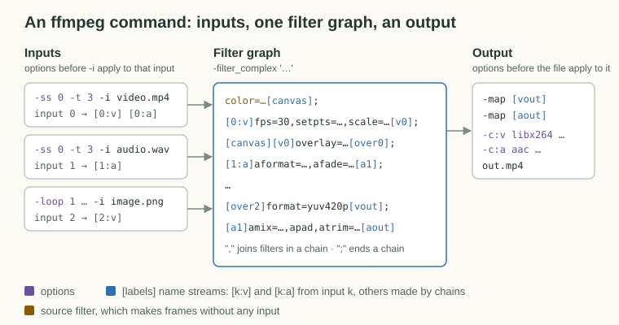
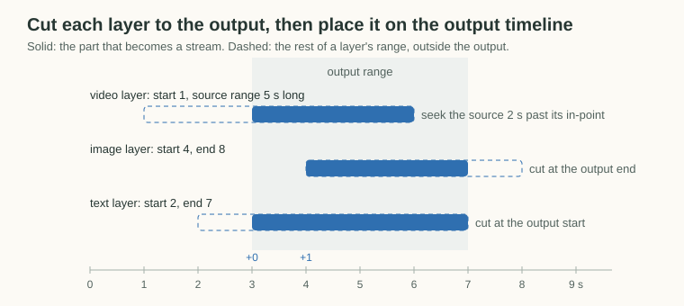
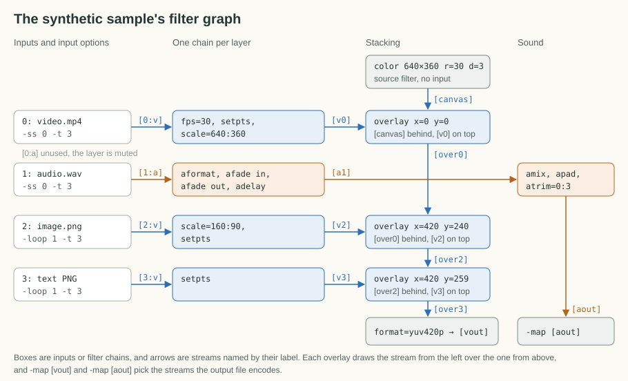

# ffmpeg compiler

The renderer in [src/lib/render](../src/lib/render) turns a project file ([project-format.md](project-format.md)) into one ffmpeg command and runs it.

```sh
pnpm setup-sample samples/synthetic
pnpm render .local/projects/synthetic/project.json .local/projects/synthetic/out/preview.mp4
pnpm render <project.json> <output> --dry-run   # print the command only
```

## Timing and Frames

- The project file's numbers are the timing truth. Offsets are set on waveforms, which are exact data, and playback only confirms them, so preview drift never shifts the final render.
- The frame shown at a source time is the one [nearest to it](project-format.md#time). A paused editor preview can be [one frame off](editor.md#differences-from-the-render), so check frame choices such as the thumbnail on a render.
- A video layer's [hold](project-format.md#hold) clones the first frame the layer reads before it and the last frame it reads after it. Audio is not held, so the held spans are silent.
- Camera footage is pre-processed outside toy-compositor to a constant frame rate, a browser-playable codec, and a one-second keyframe interval, so the compiler can assume evenly spaced frames and the editor can play and seek it ([pre-processing](preprocessing.md)).

## Draw Text, Compile, Run

A render has three steps. First, it draws each text layer to a transparent PNG with ImageMagick. Then the project, which carries its media info ([project-format.md](project-format.md#media)), and the text images are compiled into ffmpeg arguments. Finally, ffmpeg runs.



Compiling reads no files and starts no processes, so it is plain data in and arguments out. All the I/O sits at the two ends. `--dry-run` stops before running ffmpeg, but it still writes the text PNGs, because the printed command refers to them.

## Read an ffmpeg Command

The compiled command has three parts: inputs, one filter graph, and an output. The rest of this doc uses the names below.



- **Input**: a file opened with `-i`. Inputs are numbered from 0 in the order they appear.
- **Input options**: options written before an `-i`, such as `-ss` (seek), `-t` (duration), or `-loop 1`. They apply only to that input and decide which part of the file is read.
- **Stream**: a sequence of video frames or audio samples. `[0:v]` is input 0's video, and `[1:a]` is input 1's audio.
- **Filter**: one operation on a stream, such as `scale=640:360` or `overlay=x=420:y=240`.
- **Chain**: filters joined by commas. It reads the labeled streams on its left and writes a new labeled stream on its right, as in `[0:v]fps=30,scale=640:360[v0]`.
- **Label**: a bracketed name that connects chains. `[k:v]` and `[k:a]` come from input `k`, and any other name is made by a chain.
- **Source filter**: a filter that makes a stream without any input, such as `color=` for a solid fill.
- **Filter graph**: every chain, separated by semicolons and passed once with `-filter_complex`.
- **Output**: `-map [label]` picks streams from the graph, and output options such as `-c:v libx264` apply to the output file that follows them.

The project maps onto those parts like this:

| Project             | ffmpeg                                                                                                               |
| ------------------- | -------------------------------------------------------------------------------------------------------------------- |
| Canvas              | A `color=` source filter at the start of the picture chain                                                           |
| Video layer         | One input and chain for its picture, and, when it has sound, a second input of the same file and chain for the sound |
| Image or text layer | One input, the image or the text PNG, and a chain                                                                    |
| Color layer         | A chain that starts with a `color=` source filter, with no input                                                     |
| Audio layer         | One input and a chain                                                                                                |
| Layer order         | The order of the `overlay` filters                                                                                   |
| Output range        | Each input's `-ss` and `-t`, each chain's `setpts` offset, and the canvas duration                                   |
| Video or still      | The output options                                                                                                   |

Layers and inputs are not one to one. A color layer has no input, a video layer with sound has two, and a layer outside the output range has none. Only the filter graph connects everything.

## Cut Each Layer to the Output

Every layer is compiled on its own, into at most one picture stream and one sound stream. A layer does not need to know which other layers exist.

First, a layer is cut to the part that falls inside the output range. A video or audio layer spans from its `start` for the length of its source range, and a video layer's picture extends by its hold on both sides. An image, text, or color layer spans from `start` to `end`. A layer with no visible part contributes nothing.



Each stream is trimmed to that visible part when ffmpeg reads the input, then shifted by its offset from the output start. For a video layer, trimming means seeking the source to the matching source time. Because project times are rounded to milliseconds, the seek targets the source frame nearest to that time rather than the first frame after it. A held video layer reads only the source inside the visible part and clones its first and last frames over the held spans, and a visible part that lies entirely in a hold reads one frame at the edge it holds.

In ffmpeg terms, the cut is input options and the rest is a filter chain. The synthetic sample's video layer covers the whole three-second output and fills the 640×360 canvas:

```sh
-ss 0.000000 -t 3.000000 -i media/video.mp4   # seek to the source time, read the visible duration
```

```text
[0:v]fps=30,setpts=PTS-STARTPTS+0/TB,scale=640:360[v0]
     │      │                        └ fit to its box
     │      └ restart timestamps at 0, then shift by the offset from the output start (0 s here)
     └ resample to the canvas frame rate
```

What each layer type turns into:

| Layer | Picture                                                                    | Sound                       |
| ----- | -------------------------------------------------------------------------- | --------------------------- |
| Video | Source frames at the canvas rate, cropped, then scaled to fit its box      | Its own audio, unless muted |
| Image | The image repeated at the canvas rate, cropped, then scaled to fit its box | None                        |
| Text  | The text PNG repeated at the canvas rate, placed at its box                | None                        |
| Color | A generated solid fill with opacity, over its box                          | None                        |
| Audio | None                                                                       | Its audio, unless muted     |

Sound is normalized to 48 kHz stereo, faded in and out at the layer's own edges when the layer asks for it, trimmed to the visible part, and delayed to its offset. The output range only cuts a layer and never moves its fades, so a sound is read from the layer's start rather than the visible part's, because `afade` cannot start before its stream does.

The ffmpeg building blocks behind the table:

| Idea                                      | ffmpeg                                                                                                                                                       |
| ----------------------------------------- | ------------------------------------------------------------------------------------------------------------------------------------------------------------ |
| Read only the visible part of a source    | input options `-ss <source time> -t <duration>`                                                                                                              |
| Repeat an image or text PNG               | input options `-loop 1 -framerate <fps> -t <duration>`                                                                                                       |
| Match the canvas frame rate               | `fps=<fps>`                                                                                                                                                  |
| Hold the first and last frames            | `tpad=start_duration=<seconds>:stop_duration=<seconds>:start_mode=clone:stop_mode=clone`                                                                     |
| Crop, then fit to the box                 | `crop=iw*<w>:ih*<h>:iw*<left>:ih*<top>`, `scale=<width>:<height>`                                                                                            |
| Generate a solid fill, as a source filter | `color=c=<color>@<opacity>:s=<width>x<height>:r=<fps>:d=<duration>`, `format=rgba`                                                                           |
| Place on the output timeline              | `setpts=PTS-STARTPTS+<offset>/TB`                                                                                                                            |
| Normalize, fade, cut, and place sound     | `aformat=sample_rates=48000:channel_layouts=stereo`, `afade=t=in` and `afade=t=out`, `atrim=start=<cut>`, `asetpts=PTS-STARTPTS`, `adelay=delays=<ms>:all=1` |

## Stack Pictures, Mix Sounds

Once every layer has its streams, one pass joins them into a single filter graph. The picture chain starts from a solid canvas covering the whole output. Each picture is overlaid on the result so far at its position, in layer order, so later layers sit on top. When a picture stream ends before the output does, the layers below show through. Every sound goes into one mix, which is padded or trimmed to the output length.

This pass is the only place that knows how streams are numbered and connected. The per-layer step only says what a layer contributes, which keeps each layer type readable on its own. To see the actual graph for a project, run the render with `--dry-run`.

For the synthetic sample, the inputs are numbered in the order they are added, and each chain's output label uses its layer's index:



A chain can read more than one stream when its filter takes more than one input. `overlay` takes two. The first label is the background, and the second is drawn on top of it at `x` and `y`, so `[canvas][v0]overlay=x=0:y=0[over0]` composites the video over the canvas. Its result `[over0]` becomes the background of the next overlay, which is how the stack is built one layer at a time. `amix` likewise takes every sound stream at once.

The same graph as ffmpeg text, wrapped and annotated for reading, with paths shortened:

```sh
-ss 0.000000 -t 3.000000 -i media/video.mp4          # input 0, layer 0 video
-ss 0.000000 -t 3.000000 -i media/audio.wav          # input 1, layer 1 audio
-loop 1 -framerate 30 -t 3.000 -i media/image.png    # input 2, layer 2 image
-loop 1 -framerate 30 -t 3.000 -i .text/out.mp4/3.png  # input 3, layer 3 text
```

```text
color=c=#000000:s=640x360:r=30:d=3[canvas];                             canvas
[0:v]fps=30,setpts=PTS-STARTPTS+0/TB,scale=640:360[v0];                 layer 0 picture
[canvas][v0]overlay=x=0:y=0:eof_action=pass[over0];                     stack on the canvas
[1:a]aformat=sample_rates=48000:channel_layouts=stereo,
     afade=t=in:st=0:d=0.2,afade=t=out:st=2.5:d=0.5,
     adelay=delays=0:all=1[a1];                                          layer 1 sound
[2:v]scale=160:90,setpts=PTS-STARTPTS+0/TB[v2];                         layer 2 picture
[over0][v2]overlay=x=420:y=240:eof_action=pass[over2];                  stack on the result so far
[3:v]setpts=PTS-STARTPTS+0/TB[v3];                                      layer 3 picture
[over2][v3]overlay=x=420:y=259:eof_action=pass[over3];                  stack on the result so far
color=c=#0080ff@0.5:s=240x135:r=30:d=3,format=rgba,
     setpts=PTS-STARTPTS+0/TB[v4];                                      layer 4 picture, no input
[over3][v4]overlay=x=40:y=100:eof_action=pass[over4];                   stack on top
[over4]format=yuv420p[vout];                                            output picture
[a1]amix=inputs=1:normalize=0:duration=longest,apad,atrim=0:3[aout]     output sound
```

The video layer is muted, so it adds no sound. `eof_action=pass` is what lets lower layers show through after a stream ends. The text sits at `y=259` rather than its box's `260` because the 2 px outline pads the PNG by 1 px. Then the video output encodes both streams:

```sh
-map [vout] -c:v libx264 -preset medium -crf 20 -r 30 -t 3 -map [aout] -c:a aac -b:a 192k -movflags +faststart out.mp4
```

## Stills

A project whose `output` is a still renders the same graph over a single frame. The output range becomes one frame long starting at the still's time, no layer contributes sound, and ffmpeg writes one image file instead of encoding a video. A thumbnail therefore only decodes each source around its time, however long the source is.

For the synthetic thumbnail at 1.5 seconds, the video input reads one frame's worth, starting a tenth of a frame before frame 45 so ffmpeg's seek lands on it, and the output writes a single PNG:

```sh
-ss 1.496667 -t 0.033333 -i media/video.mp4
-map [vout] -frames:v 1 -update 1 thumbnail.png
```

## Why ffmpeg

A project is declarative data, so it compiles directly to an ffmpeg filter graph. A React-based renderer such as Remotion would need a JSON-to-React interpreter in front of it, and its offline render captures every frame from headless Chrome, which buys nothing for static layouts of existing media. ffmpeg also gives direct control over encoding and file size.

## Known gaps

- Color metadata is incomplete. The output is BT.709 limited range like typical camera footage, but only the matrix is tagged, not the transfer and primaries. RGB layers (images, text, color) are likely converted to YUV with ffmpeg's default BT.601 matrix while the file says BT.709, so they may be very slightly off. The fix is to convert with `out_color_matrix=bt709:out_range=tv` and tag the output with `-colorspace bt709 -color_primaries bt709 -color_trc bt709`. It is only visible side by side.
- Encoding is fixed at `libx264 -crf 20 -preset medium` and not tuned for file size.
- The filter graph is one command per render, so a still still spawns ffmpeg with every input. A thumbnail renders in about 0.5s, but long seeks into large files have not been tried.
