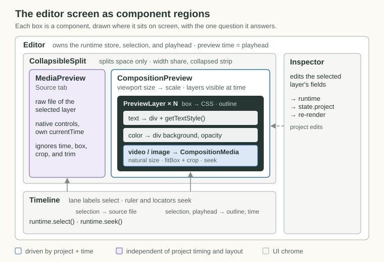
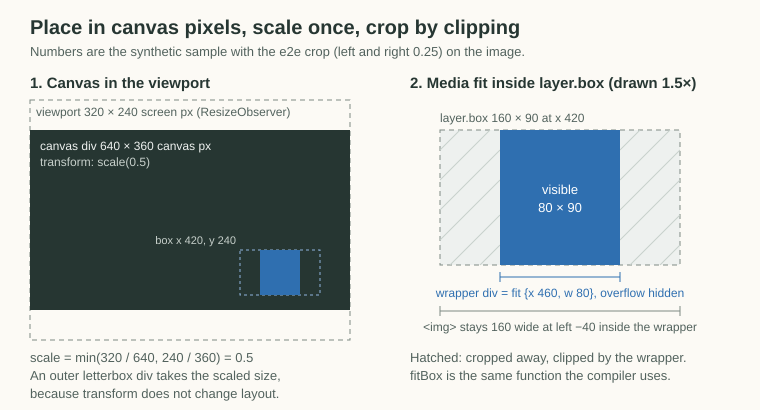
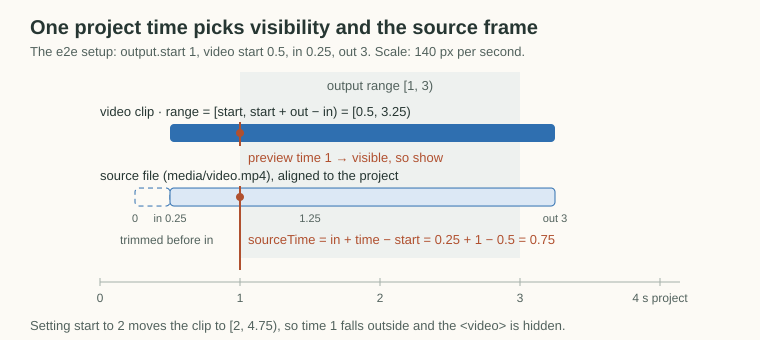
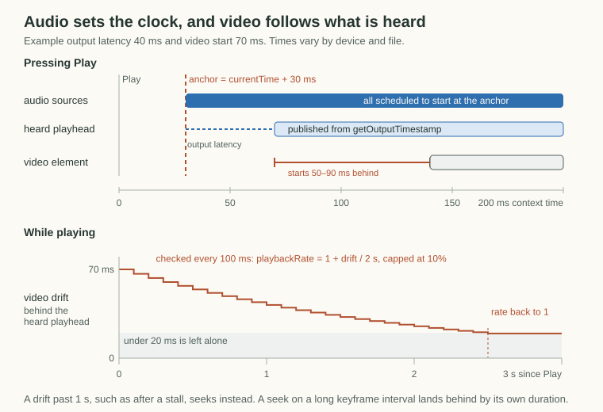

# Editor preview

The editor composes the project in the DOM at one project time. Each visual layer is an absolutely positioned `<video>`, ``, or div, placed in canvas pixels inside a canvas-sized div, and the whole canvas is CSS-scaled to fit the monitor. The preview shares layout math with the [compiler](compiler.md) (`fitBox` and `getOutputRange` in [src/lib/layout.ts](../src/lib/layout.ts)), but not its rendering, so the ffmpeg render stays the truth for exact frames and text.

## Components

Each component answers one question about the preview, and the preview holds no project state of its own. Inspector edits go through the runtime into `state.project`, and the composition re-renders from it, so edits show up immediately without extra wiring.



```text
Editor                     editor.tsx               runtime store, selection, playhead
├─ CollapsibleSplit        collapsible-split.tsx    side panel width, collapsed strip
│  ├─ MediaPreview         media-preview.tsx        the selected layer's raw file
│  └─ CompositionPreview   composition-preview.tsx  viewport scale, layers visible at time, audio
│     └─ PreviewLayer × N                           box to CSS, per-type rendering, outline
│        └─ CompositionMedia  composition-media.tsx natural size, fit and crop, video
├─ Timeline                timeline.tsx             selection, seeking the playhead
└─ Inspector               inspector.tsx            project edits
```

The Source monitor is deliberately separate from the composition. It shows the whole file with native controls and its own `currentTime`, ignoring the layer's timing, box, and crop, so scrubbing it never moves the composition.

## Place in Canvas Pixels, Scale Once

Layers use the project's numbers directly as CSS pixels inside a canvas div of `canvas.width × canvas.height`, which is the same space the compiler works in. The canvas div is scaled by `min(viewport width / canvas width, viewport height / canvas height)`, measured with a `ResizeObserver`. An outer div takes the scaled size, because `transform` does not change layout, so centering would otherwise use the unscaled size.



Video and image layers go through the compiler's `fitBox`, which returns the visible cropped rectangle inside `layer.box`. The DOM cannot crop an element directly, so a wrapper div with `overflow: hidden` is that rectangle, and the media element inside keeps its uncropped size at the fitted scale, shifted by the left and top crop. The wrapper stays hidden until the browser reports the media's natural size.

## Pick Layers and Frames by Time

The preview time decides which layers show and which frame each video shows. A layer shows when the time falls in its half-open range from `getLayerRange` in [src/lib/layout.ts](../src/lib/layout.ts), which the compiler uses too. Video and audio layers span their trimmed source from `start`, and other layers span from `start` to `end`. A visible video seeks to `in + time − start`.



Every layer stays mounted and is hidden outside its range, so its media is loaded before playback reaches it. Layers draw in project order, so later layers sit on top, matching the compiler's overlay order. Audio layers draw nothing, and their sound plays on the transport, described below.

The selected layer gets a read-only outline, drawn as a second div with the same box. Text layers have no height, so the outline holds an invisible copy of the text to match it.

## Play Along the Transport

The runtime owns playback, like toy-midi's recorder runtime. Audio on the `AudioContext` clock sets the time, and the playhead and video follow what is heard.

```text
EditorRuntime              runtime.ts                source loading, restarts around changes
└─ AudioContextTransport   transport.ts              playhead, play, pause, seek
   ├─ AudioBufferPlayback  audio-buffer-playback.ts  one per audio and video layer, scheduled on the clock
   └─ VideoPlayback        video-playback.ts         one per composition <video>, follows the heard position
```



- **The heard position comes from `getOutputTimestamp`,** because Chromium on Linux reports `outputLatency` as 0.
- **Audio is scheduled, never steered.** A layer plays wherever its own range covers the playhead, so trimming decides what plays. Fades are gain ramps, and `muted` silences the layer.
- **Playbacks start only at the anchor.** An edit, or a buffer that arrives during playback, restarts the transport around the change, like toy-midi's `updateClips`.
- **Sources load in the background.** Loading a project decodes each source once, shared by its layers, so opening never waits on a long source.
- **Pausing lands on the frame grid,** so a paused preview matches a rendered frame.

## Known gaps

- A paused video shows whatever frame the browser picks for `currentTime`, while the compiler snaps to the nearest source frame, so the preview may be one frame off.
- Text is DOM text with `-webkit-text-stroke` and an estimated line height, while the compiler draws it with ImageMagick, so glyph placement differs slightly.
- The transport publishes the playhead through the editor store, so the editor re-renders on every animation frame while playing, like toy-midi's recorder.
- A video starts 50 to 90 ms behind the sound right after Play and catches up within a few seconds, because the element takes that long to start.
- Each video and audio source decodes whole into memory, about 60MB for a 3-minute stereo mix, and a video source is downloaded in full for its audio (#85).
- Layers are keyed by index, which holds until layers can be added or reordered.
