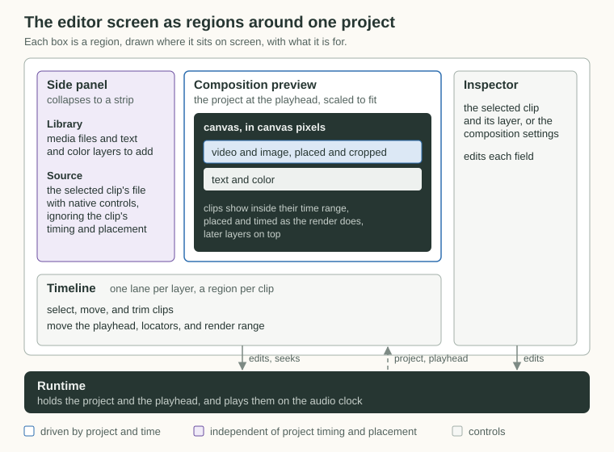

# Editor

The editor composes the project in the DOM at one project time. Each visual clip is an absolutely positioned `<video>`, ``, or div, placed in canvas pixels inside a canvas-sized div, and the whole canvas is CSS-scaled to fit the monitor. The preview shares the [compiler](compiler.md)'s layout and timing math, which places each clip and decides when it shows, but not its rendering, so it differs from the render in the places listed [below](#differences-from-the-render).

## Screen

The screen has four regions around one project.

The runtime holds the project in a store, and the regions hold no project state of their own. An edit from any region goes through the runtime into the project, and every region re-renders from it, so a change in the inspector or a drag on the timeline shows up everywhere without extra wiring. Selection and gestures live in the UI, which decides placement and snapping before it calls the runtime.

The Source monitor is deliberately separate from the composition. It shows the whole file with native controls and its own `currentTime`, ignoring the clip's timing, transform, and crop, so scrubbing it never moves the composition.

## Place in Canvas Pixels, Scale Once

Clips use the project's numbers directly as CSS pixels inside a canvas div of `canvas.width × canvas.height`, which is the same space the compiler works in. The canvas div is scaled by `min(viewport width / canvas width, viewport height / canvas height)`, which follows the viewport as it resizes. An outer div takes the scaled size, because `transform` does not change layout, so centering would otherwise use the unscaled size.

Video and image clips use the compiler's visible box, the cropped rectangle that `clip.transform` places. The DOM cannot crop an element directly, so a wrapper div with `overflow: hidden` is that rectangle, and the media element inside keeps its uncropped size at the same scale, shifted by the left and top crop. The source's size comes from the project's `media`, the same number the compiler scales with, so the layout is right before the media loads.

## Pick Clips and Frames by Time

The preview time decides which clips show and which frame each video shows. A clip shows when the time falls in its half-open picture range, which the compiler uses too. Video and audio clips span their trimmed source from `start`, extended by a video clip's hold, and other clips span from `start` to `end`. A visible video seeks to `in + time − start`.

Every clip stays mounted and is hidden outside its range or on a `hidden` layer, so its media is loaded before playback reaches it. Clips draw in [layer order](project-format.md#layers), so later layers sit on top. Audio clips draw nothing, and their sound plays on the transport, described below.

The selected clip gets a read-only outline, drawn as a second div with the same rectangle. Clicking the preview selects the topmost visible clip under the pointer, because the browser hits each clip's own element in the same layer order, and clicking empty space clears the selection. Dragging selects and moves that same clip by the pointer's travel divided by the preview scale. Like a timeline drag, it shows as a draft and commits on release, so playback reschedules once. A selected video or image clip also shows corner handles at a constant size on screen. Dragging one scales the clip about the opposite corner of its visible box, which stays pixel-exact, because the placed size is rounded first and the position is derived from it.

## Play Along the Transport

The runtime owns playback. Audio on the `AudioContext` clock sets the time, and the playhead and video follow what is heard.

The transport owns the clock and the playhead, and plays, pauses, and seeks. Each audio and video clip has an audio playback scheduled on that clock, and each composition `<video>` has a video playback that follows the heard position. The runtime loads sources and restarts the transport around changes.

- **The heard position comes from `getOutputTimestamp`,** because Chromium on Linux reports `outputLatency` as 0.
- **Audio is scheduled, never steered.** A clip plays wherever its own range covers the playhead, so trimming decides what plays. Fades are gain ramps, and a layer's `muted` silences its clips.
- **Playbacks start only at the anchor.** An edit, or a buffer that arrives during playback, restarts the transport around the change.
- **Sources load in the background.** Loading a project decodes each source once, shared by its clips' playback and lane waveforms, so opening never waits on a long source.
- **Pausing snaps the playhead to the frame grid,** so a paused preview shows the same time as a rendered frame.
- **A paused video shows the source frame the render picks,** the one nearest the source time. The element shows the last frame at or before its `currentTime`, so it seeks just past that frame's timestamp.

## Differences from the render

- Text is DOM text with `-webkit-text-stroke` and an estimated line height, while the render draws it with ImageMagick, so glyph placement differs slightly.

## Known gaps

- The transport publishes the playhead through the editor store, so the editor re-renders on every animation frame while playing.
- A video starts 50 to 90 ms behind the sound right after Play and catches up within a few seconds, because the element takes that long to start.
- Each video and audio source decodes whole into memory, about 60MB for a 3-minute stereo mix, and a video source is downloaded in full for its audio (#85).
