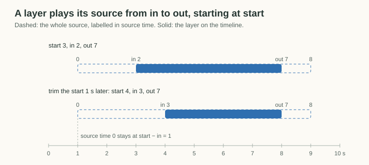

# Project format

A project is one JSON file that describes one deliverable: a canvas, an output, which is a video range or a still frame, and a stack of layers. Variants of a cover, such as the horizontal video and its thumbnail, are separate project files, and each one is self-contained.

This doc describes what a project means. The [renderer](compiler.md) turns it into the finished video or image, and the [editor](editor.md) previews it in the browser while you edit.

```jsonc
{
  "canvas": {
    "width": 1920,
    "height": 1080,
    "fps": 30,
    "background": "#000000",
  },
  "output": { "type": "video", "start": 23.7, "end": 188.633 },
  // or { "type": "still", "time": 106.833 }
  "layers": [
    // bottom to top
  ],
  "locators": [
    // optional labeled times, see below
  ],
  "media": {
    // facts about each media file, keyed by src, see below
  },
}
```

## Time

All times are seconds. Timeline times (`start`, `end`, `output.*`) are positions on the project timeline. Source times (`in`, `out`) are positions in a media file, measured as presentation timestamps including the stream's start offset. The frame shown at a source time is the frame whose timestamp is nearest to it, because millisecond times rarely land exactly on a frame.

A video or audio layer plays its source from `in` to `out`, starting at timeline position `start`, which is the usual clip model of video editors. The source's alignment against the timeline is therefore `start - in`, the timeline position of source time 0, and it is not stored on its own. Changing `start` moves the layer with its source. Changing `in` alone shifts the source against the timeline, so trimming a layer's start moves `start` and `in` by the same amount, which keeps the alignment.



An image, text, or color layer is visible from timeline position `start` to `end`. Every layer sets its range, so a layer's timing never depends on the output. An overlay meant for the whole cover, such as the title, spans the main video's output range, which also covers variants whose output falls inside it, such as the thumbnail.

## Layers

Layers stack in list order over the canvas `background`, so later layers sit on top. The sound of all video and audio layers is mixed together.

Every layer can have an optional `name`, such as `"camera"`, `"score"`, or `"mix"`. Names do not affect rendering. They label layers in the editor and let scripts find a layer by its role instead of its position in the list.

### `video`

```jsonc
{
  "name": "camera",
  "type": "video",
  "src": "media/camera.mp4",
  "start": 7.967,
  "in": 0,
  "out": 189.499,
  "box": { "x": 0, "y": 0, "width": 1920, "height": 1080 },
  "crop": { "left": 0.013, "top": 0.0065 },
  "muted": true,
}
```

A video layer carries its file's audio, like a clip in other video editors, and the audio is trimmed and mixed the same way as an `audio` layer, including `fadeIn` and `fadeOut`, which fade only the audio. `muted` leaves the audio out of the mix. The camera is a muted video layer, so it moves as one thing and its audio stays available in the editor as a waveform for syncing against the mix. A video file without an audio stream contributes nothing to the mix.

### `audio`

```jsonc
{
  "type": "audio",
  "src": "media/mix.wav",
  "start": 23.7,
  "in": 10.333,
  "out": 175.233,
  "fadeIn": 0,
  "fadeOut": 4.7,
}
```

`fadeIn` and `fadeOut` are durations in seconds at the edges of the layer's own range, from `start` to `start + out - in`. The output range only cuts a layer, so an output that starts or ends inside a fade renders that part of the fade and does not fade again at its own edges. To fade at the output's edges, trim the layer to them. `muted` leaves the layer out of the mix.

### `image`

```jsonc
{
  "type": "image",
  "src": "media/mv-thumbnail.jpg",
  "start": 23.7,
  "end": 188.633,
  "box": { "x": 960, "y": 540, "width": 960, "height": 540 },
}
```

### `text`

```jsonc
{
  "type": "text",
  "text": "RESCENE\nLOVE ATTACK\n(John Park ver.)",
  "start": 23.7,
  "end": 188.633,
  "box": { "x": 336, "y": 222, "width": 1247 },
  "align": "center",
  "font": {
    "family": "Noto Sans CJK KR",
    "size": 160,
    "weight": 700,
    "lineSpacing": -30,
  },
  "color": "#ffffff",
  "outline": { "width": 10, "color": "#000000" },
}
```

Text is rendered to a transparent PNG and composited like an image, so the renderer does not depend on ffmpeg's `drawtext`. `box.y` is the top of the first line at the font's normal line height, and `lineSpacing` is added only between lines.

### `color`

```jsonc
{
  "type": "color",
  "color": "#000000",
  "opacity": 0.51,
  "box": { "x": 0, "y": 0, "width": 1920, "height": 1080 },
  "start": 23.7,
  "end": 188.633,
}
```

A solid fill over its `box`, used for the translucent dim under thumbnail titles.

## Locators

Locators are labeled timeline times, like markers in other video editors. They do not affect rendering. They record judgment calls that belong to one project but are used elsewhere, such as which frame becomes a thumbnail or which range becomes a short, so scripts can look them up by label to generate other deliverables.

```jsonc
"locators": [
  { "label": "thumbnail", "time": 106.833 },
  { "label": "shorts-start", "time": 144.033 },
  { "label": "shorts-end", "time": 186.4 }
]
```

## Media

`media` holds what ffprobe reports about every media file the layers use, keyed by the layers' `src`. The project then describes its media completely, so the editor, the renderer, and scripts all read the same facts. Every `src` a layer uses has an entry, and video and image layers' entries have `video`. The editor and the renderer check this when they load a project and name the layer and the fix if it fails.

```jsonc
"media": {
  "media/camera.mp4": {
    "start": 0,
    "end": 189.499,
    "video": { "width": 1920, "height": 1080, "startTime": 0, "frameRate": 29.97002997002997 },
    "audio": true
  },
  "media/mix.wav": { "start": 0, "end": 185.3, "audio": true },
  "media/mv-thumbnail.jpg": {
    "start": 0,
    "end": 0,
    "video": { "width": 1280, "height": 720, "startTime": 0, "frameRate": 25 },
    "audio": false
  }
}
```

- `start` and `end` bound the file's source times, the same presentation timestamps as `in` and `out`, so they include the container's start offset. A still image has no duration, so both are 0.
- `video` is the video stream's size, its own start time, and its frame rate, which the compiler's frame timing counts from. Only files with a video stream have it, including images.
- `audio` says whether the file has an audio stream, which decides whether a video layer contributes to the mix.

An entry depends only on the file's contents, so a copied file has the same entry. Facts describe a file, not a layer, so layers that share a file share its entry. Each project file carries its own `media`, so variants such as the thumbnail repeat the entries they share and stay self-contained.

`toy-compositor update-media <project.json...>` fills `media` from the files the layers use, replacing what was there, for example after hand-editing layers or replacing a file.

## Box and crop

`box` is where a visual layer goes on the canvas. The source is scaled to fit inside the box while keeping its aspect ratio and is centered in it. Anything outside the canvas is clipped.

`crop` removes a fraction of the source from each edge before fitting, with each side defaulting to 0.

## Hold

A video layer can keep showing its first frame before `start` and its last frame after its source range ends, so a clip without lead-in or tail, such as a score video, still covers the whole output.

```jsonc
{
  "type": "video",
  "src": "media/score.mp4",
  "start": 23.7,
  "in": 0,
  "out": 160,
  "box": { "x": 781, "y": 473, "width": 1152, "height": 648 },
  "hold": { "before": 5, "after": 10 },
}
```

`before` and `after` are durations in seconds. They extend only the layer's picture, so its timing stays its source range and the held spans are silent.

## Older formats

The editor and the renderer read only the current format and reject a project with an older shape, naming `toy-compositor migrate <project.json...>`. That command rewrites each file in place with the editor's JSON formatting and prints the layers it changed, and `--check` only lists them, exiting non-zero if anything would change. Missing media is reported before an older shape.

The format has no version number, so an older project is recognized by its shape alone. A format change must therefore change the shape, such as renaming or adding a field, and never only the meaning of an existing field, or `migrate` could not tell the old file apart from a current one.
